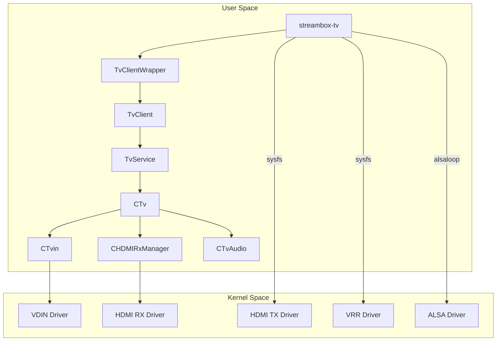

# StreamBox TV Server Architecture

## Overview

`aml_tvserver_streambox` is a TV server application for Amlogic-based devices that provides HDMI passthrough with low-latency game mode and VRR (Variable Refresh Rate) support.

## Directory Structure

```
aml_tvserver_streambox/
├── include/          # Header files
│   └── amlogic/      # Kernel interface headers (ioctl definitions)
├── libtv/            # Core TV library (C++)
│   ├── CTv.cpp       # Main TV controller
│   ├── CTvin.cpp     # Video input handling
│   ├── CHDMIRxManager.cpp  # HDMI receiver management
│   ├── CTvAudio.cpp  # Audio patch management
│   └── tvutils/      # Utility functions
├── client/           # Client library
│   ├── TvClient.cpp  # Client implementation (talks to TvService)
│   └── TvClientWrapper.cpp  # C wrapper for C++ client
├── service/          # Service daemon
│   ├── TvService.cpp # Binder service handling requests
│   └── main_tvservice.cpp
├── test/             # Test applications
│   ├── streambox-tv.c     # Main StreamBox TV application
│   └── hdmiin-demo.c      # Legacy HDMI-in demo
└── doc/              # Documentation (this folder)
```

## Component Diagram



## Data Flow

### Video Path
1. **HDMI RX** receives video signal from external device (PS5, PC, etc.)
2. **VDIN** (Video Digitizer Input) captures the video frames
3. **HDMI TX** outputs to connected display with matched timing
4. **VRR** (when enabled) provides frame lock for low-latency output

### Audio Path
1. **HDMI RX** extracts audio from HDMI input
2. **alsaloop** process captures from `hw:0,2` (HDMI RX)
3. **alsaloop** plays back to `hw:0,0` (HDMI TX)

## Key Classes

| Class | File | Purpose |
|-------|------|---------|
| `CTv` | libtv/CTv.cpp | Main TV controller, manages source switching |
| `CTvin` | libtv/CTvin.cpp | Video input handling, VDIN control |
| `CHDMIRxManager` | libtv/CHDMIRxManager.cpp | HDMI RX settings (EDID, HDCP, ALLM, VRR) |
| `CTvAudio` | libtv/CTvAudio.cpp | Audio patch creation/release |
| `TvService` | service/TvService.cpp | Service daemon for client requests |
| `TvClient` | client/TvClient.cpp | Client-side API |

## Sysfs Interfaces

| Path | Purpose |
|------|---------|
| `/sys/class/aml_vrr/vrr2/debug` | VRR control (mode, enable) |
| `/sys/class/amhdmitx/amhdmitx0/disp_mode` | HDMI TX output mode |
| `/sys/class/amhdmitx/amhdmitx0/hpd_state` | HDMI TX hotplug status |
| `/sys/class/amhdmitx/amhdmitx0/frac_rate_policy` | Fractional framerate policy |
| `/sys/class/vdin/vdin0/input_rate` | VDIN input framerate |
| `/sys/class/graphics/fb0/blank` | Framebuffer blanking |

## Build System

Uses GNU Make. Key targets:
- `make streambox-tv` - Build main application
- `make tvserver` - Build service daemon
- `make tvclient` - Build client library

### Build Flags
- `STREAM_BOX` - Enable StreamBox-specific features
- `STREAM_BOX_TRACE` - Enable verbose tracing
- `STREAM_BOX_LEGACY` - Legacy mode (skip init_check)
